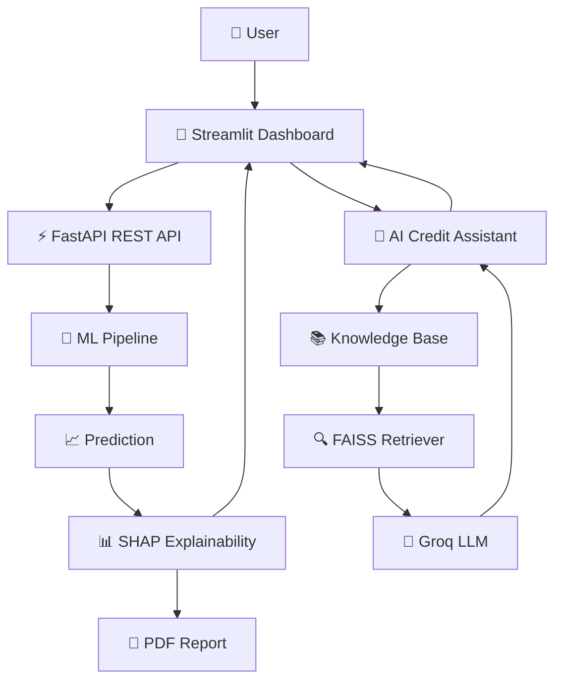

<p align="center">
  
</p>

<h1 align="center">
🚀 AI Credit Underwriting Platform
</h1>

<p align="center">

🚀 <strong>Production-Ready AI Credit Underwriting Platform</strong>

Predict loan approvals using Machine Learning with transparent SHAP explanations,
AI-powered credit assistance (RAG), FastAPI backend, Streamlit dashboard,
and Dockerized deployment.

</p>

<p align="center">

<a href="https://ai-predictive-methods-for-credit-underwriting-dfqmcy7nmn2bczde.streamlit.app">

</a>

<a href="https://ai-predictive-methods-for-credit.onrender.com/docs">

</a>

<a href="https://ai-predictive-methods-for-credit.onrender.com/health">

</a>

</p>

---

<p align="center">
<b>Production Machine Learning • Explainable AI • RAG • FastAPI • Streamlit • Docker</b>
</p>

<p align="center">

[](https://www.python.org/)
[](https://fastapi.tiangolo.com/)
[](https://streamlit.io/)
[](https://scikit-learn.org/)
[](https://shap.readthedocs.io/)
[](https://github.com/facebookresearch/faiss)
[](https://groq.com/)
[](https://www.docker.com/)
[]
[]

</p>

---

# 🌐 Live Demo

### 🚀 Streamlit Dashboard

https://ai-predictive-methods-for-credit-underwriting-dfqmcy7nmn2bczde.streamlit.app

### ⚡ FastAPI Health Endpoint

https://ai-predictive-methods-for-credit.onrender.com/health

### 📄 Swagger API Documentation

https://ai-predictive-methods-for-credit.onrender.com/docs

---

# 📑 Table of Contents

- [Live Demo](#-live-demo)
- [Project Overview](#-project-overview)
- [Key Features](#-key-features)
- [System Architecture](#️-system-architecture)
- [Tech Stack](#️-tech-stack)
- [Project Structure](#-project-structure)
- [Installation](#-installation)
- [Docker Deployment](#-docker-deployment)
- [Run Without Docker](#️-run-without-docker)
- [REST API Endpoints](#-rest-api-endpoints)
- [Machine Learning Pipeline](#-machine-learning-pipeline)
- [Explainable AI](#-explainable-ai-shap)
- [RAG Workflow](#-retrieval-augmented-generation-rag)
- [Screenshots](#-screenshots)
- [Deployment](#-deployment)
- [Engineering Highlights](#-engineering-highlights)
- [Resume Highlights](#-resume-highlights)
- [Interview Topics](#-interview-discussion-topics)
- [Author](#-author)

---
# 📌 Project Overview

AI Credit Underwriting Platform is a **production-inspired Machine Learning application** that predicts whether a loan application should be **Approved** or **Rejected** using a trained **Gradient Boosting Classifier**.

Unlike traditional academic ML projects, this system follows a modular software architecture by separating:

- Frontend (Streamlit)
- Backend (FastAPI REST API)
- Machine Learning Pipeline
- Explainable AI (SHAP)
- Retrieval-Augmented Generation (RAG)
- Dockerized Deployment

The application not only predicts loan approval but also explains every prediction using **SHAP Explainability**, generates downloadable **PDF underwriting reports**, and provides an **AI Credit Assistant** capable of answering domain-specific underwriting questions using a Retrieval-Augmented Generation pipeline powered by **FAISS** and **Groq LLM**.

---

# ✨ Key Features

## 🤖 Machine Learning

- Production-ready Gradient Boosting Model
- Serialized Scikit-Learn Pipeline
- Probability Prediction
- Feature Engineering
- Consistent Training & Inference Pipeline

---

## ⚡ FastAPI Backend

- REST API
- Swagger Documentation
- Request Validation
- Pydantic Schemas
- Health Monitoring Endpoint

---

## 🎨 Streamlit Dashboard

- Interactive UI
- Modern Design
- Real-time Predictions
- User-friendly Forms
- Dynamic Charts

---

## 📊 Explainable AI

- SHAP Explainability
- Feature Importance
- Top Positive Factors
- Top Negative Factors
- Decision Reasoning

---

## 📄 PDF Report Generation

Automatically generates an underwriting report containing:

- Applicant Details
- Loan Information
- Prediction
- Approval Probability
- SHAP Explanation
- Feature Importance

---

## 🤖 AI Credit Assistant

Retrieval-Augmented Generation (RAG) powered chatbot capable of answering questions related to:

- RBI Guidelines
- Credit Policies
- Loan Documentation
- Credit Underwriting
- Loan Approval Reasons
- Prediction-aware Responses

Powered by:

- FAISS Vector Search
- Sentence Transformers
- Groq LLM

---

## 🐳 Dockerized Deployment

The entire application runs inside Docker containers using Docker Compose.

Services:

- FastAPI Backend
- Streamlit Frontend

Single command deployment:

```bash
docker compose up --build
```

---

# 🏗️ System Architecture



---

# 🛠️ Tech Stack

| Category | Technologies |
|-----------|--------------|
| Language | Python |
| Backend | FastAPI, Uvicorn |
| Frontend | Streamlit |
| Machine Learning | Scikit-Learn |
| Explainability | SHAP |
| Data Processing | Pandas, NumPy |
| Vector Database | FAISS |
| Embeddings | Sentence Transformers |
| LLM | Groq |
| PDF Generation | FPDF2 |
| Deployment | Docker, Docker Compose, Render |
| API Testing | Swagger UI |

---

# 📂 Project Structure

```text
AI-Predictive-Methods-for-Credit-underwriting/

│
├── api/
│   ├── main.py
│   ├── predictor.py
│   ├── explain.py
│   ├── model_loader.py
│   └── schemas.py
│
├── rag/
│   ├── embeddings.py
│   ├── retriever.py
│   ├── vector_store.py
│   ├── groq_generator.py
│   └── loader.py
│
├── knowledge/
├── models/
├── docs/
│
├── docker/
│   ├── Dockerfile.api
│   └── Dockerfile.streamlit
│
├── tests/
├── assets/
├── notebooks/
│
├── docker-compose.yml
├── requirements.txt
├── requirements-api.txt
├── streamlit_app.py
└── README.md
```

---

# 🚀 Installation

Clone the repository

```bash
git clone https://github.com/krish8986/AI-Predictive-Methods-for-Credit-underwriting.git

cd AI-Predictive-Methods-for-Credit-underwriting
```

Create a virtual environment

```bash
python -m venv .venv
```

### Windows

```bash
.venv\Scripts\activate
```

### Linux / macOS

```bash
source .venv/bin/activate
```

Install dependencies

```bash
pip install -r requirements.txt
pip install -r requirements-api.txt
```

---

# 🐳 Docker Deployment

Build and start the application

```bash
docker compose up --build
```

Backend

```
http://localhost:8001
```

Swagger

```
http://localhost:8001/docs
```

Frontend

```
http://localhost:8501
```

---

# ▶️ Run Without Docker

### Start FastAPI

```bash
uvicorn api.main:app --reload
```

Open

```
http://127.0.0.1:8000/docs
```

---

### Start Streamlit

```bash
streamlit run streamlit_app.py
```

Open

```
http://localhost:8501
```

---

# 📡 REST API Endpoints

| Method | Endpoint | Description |
|---------|----------|-------------|
| GET | `/health` | API Health Status |
| POST | `/predict` | Loan Prediction |
| POST | `/ask` | AI Credit Assistant |

---

# 🧠 Machine Learning Pipeline

The prediction engine is built using a production-oriented Scikit-Learn Pipeline to ensure identical preprocessing during both training and inference.

### Pipeline Components

- Data Cleaning
- Feature Engineering
- ColumnTransformer
- OneHotEncoder
- GradientBoostingClassifier
- Joblib Model Serialization

This architecture eliminates training-serving skew by preserving preprocessing logic inside the trained pipeline.

---

# 📊 Explainable AI (SHAP)

Model predictions are interpreted using **SHAP (SHapley Additive exPlanations)**.

The dashboard provides:

- Approval Probability
- Rejection Probability
- SHAP Feature Importance
- Top Positive Decision Factors
- Top Negative Risk Factors
- Individual Prediction Explanation

This makes every prediction transparent and easy to understand.

---

# 🤖 Retrieval-Augmented Generation (RAG)

The AI Credit Assistant is powered by a Retrieval-Augmented Generation pipeline.

Workflow:

```text
User Question
      │
      ▼
Sentence Transformer Embeddings
      │
      ▼
FAISS Vector Search
      │
      ▼
Relevant Knowledge Chunks
      │
      ▼
Groq LLM
      │
      ▼
Final AI Response
```

The assistant can answer questions related to:

- RBI Guidelines
- Credit Underwriting
- Loan Documentation
- Credit Policy
- Risk Factors
- Prediction Explanation

Every answer includes **source citations** to improve transparency and trust.

---

# 📊 Input Features

The model predicts loan approval using **17 carefully selected features**.

### Applicant Information

- Applicant Age
- Gender
- Marital Status

### Employment Details

- Employment Status
- Residence Type
- Active Loans

### Loan Information

- Loan Purpose
- Loan Amount
- Loan Term
- Interest Rate
- Loan Percentage of Income

### Financial Information

- Annual Income
- CIBIL Score

### Asset Information

- Residential Assets
- Commercial Assets
- Luxury Assets
- Bank Assets

---

# 📄 Prediction Output

The application returns:

- Loan Decision
- Approval Probability
- Rejection Probability
- SHAP Explainability
- Top Positive Factors
- Top Negative Factors
- Feature Importance Chart
- Explainable PDF Report
- AI Credit Assistant Response
- Source Citations

---

# 📸 Screenshots

## Dashboard

<p align="center">

</p>

---

## Prediction Result

<p align="center">

</p>

---

## AI Credit Assistant

<p align="center">

</p>

---

## Swagger API

<p align="center">

</p>

---

## PDF Report

<p align="center">

</p>

---

# 🌍 Deployment

### Backend

- Render

### Frontend

- Streamlit Community Cloud

### Containerization

- Docker
- Docker Compose

### API Documentation

Swagger UI available at:

```
/docs
```

---

# ⚙️ Environment Variables

Create a `.env` file:

```env
GROQ_API_KEY=your_api_key

MODEL_PATH=models/credit_underwriting_pipeline.pkl

FAISS_INDEX_PATH=models/rag_index/index.faiss

EMBEDDING_MODEL=sentence-transformers/all-MiniLM-L6-v2
```

---

# 💡 Engineering Highlights

This project demonstrates production-inspired software engineering practices.

### Backend Engineering

- REST API Development
- FastAPI
- Request Validation
- Modular Codebase
- Health Monitoring

### Machine Learning

- Production ML Pipeline
- Explainable AI
- SHAP
- Gradient Boosting
- Probability Prediction

### AI Engineering

- Retrieval-Augmented Generation
- FAISS Vector Search
- Sentence Transformers
- Prompt Engineering
- Groq LLM Integration

### Frontend

- Streamlit Dashboard
- Interactive Forms
- API Integration
- PDF Report Generation

### DevOps

- Docker
- Docker Compose
- Environment Configuration
- Cloud Deployment

---

# 🎯 Skills Demonstrated

- Python
- FastAPI
- Streamlit
- Machine Learning
- Scikit-Learn
- SHAP
- REST APIs
- Docker
- Docker Compose
- Render Deployment
- Prompt Engineering
- FAISS
- Retrieval-Augmented Generation
- Sentence Transformers
- Groq API
- Git
- GitHub

---

# 🗺️ Project Roadmap

## ✅ Completed

- Production ML Pipeline
- FastAPI REST API
- Streamlit Dashboard
- Explainable AI (SHAP)
- PDF Report Generation
- AI Credit Assistant
- Retrieval-Augmented Generation
- FAISS Vector Search
- Groq Integration
- Docker Support
- Docker Compose
- Cloud Deployment
- Health Monitoring

---

## 🚀 Future Enhancements

- CI/CD with GitHub Actions
- Unit & Integration Testing
- Structured Logging
- Monitoring & Metrics
- Authentication
- Rate Limiting
- Kubernetes Deployment
- Model Versioning
- MLflow Integration

---

# 💼 Resume Highlights

This project demonstrates practical experience in:

- Production Machine Learning
- AI-powered Decision Support Systems
- Explainable AI (XAI)
- REST API Development
- Backend Engineering
- Containerized Deployment
- Retrieval-Augmented Generation
- Cloud Deployment
- Software Architecture

---

# 🎤 Interview Discussion Topics

This project can be used to discuss:

- Why FastAPI instead of Flask?
- Why use a Scikit-Learn Pipeline?
- Why separate frontend and backend?
- How does SHAP explain model predictions?
- How does Retrieval-Augmented Generation work?
- Why FAISS instead of a relational database?
- Why use Groq for inference?
- How does Docker simplify deployment?
- How would you scale this application?
- How would you improve this system for production?

---

# 🌟 Why This Project?

Unlike traditional ML notebooks, this project demonstrates how a Machine Learning model can be deployed as a production-inspired application by combining:

- ✅ FastAPI REST APIs
- ✅ Streamlit Frontend
- ✅ SHAP Explainability
- ✅ Retrieval-Augmented Generation (RAG)
- ✅ FAISS Vector Search
- ✅ Groq LLM Integration
- ✅ Dockerized Deployment
- ✅ Cloud Hosting
- ✅ Explainable PDF Reports

This repository showcases practical AI engineering, backend development, and deployment skills expected in modern production environments.

---
# 📜 License

This project is licensed under the MIT License.

---

# 👨‍💻 Author

## Krishna Kumar

**B.Tech Electronics & Communication Engineering (Minor in AI/ML)**

Backend Developer • Machine Learning Engineer • AI Enthusiast

### Connect with Me

- **GitHub:** https://github.com/krish8986
- **LinkedIn:** https://www.linkedin.com/in/krishna-kumar-deve/

---

# ⭐ Support

If you found this project useful:

- ⭐ Star this repository
- 🍴 Fork it
- 🛠️ Contribute improvements
- 💬 Share your feedback

Your support motivates further development and helps improve the project.

---

<p align="center">

### 🚀 Building Explainable, Trustworthy & Production-Ready AI Systems

**Made with ❤️ by Krishna Kumar**

</p>