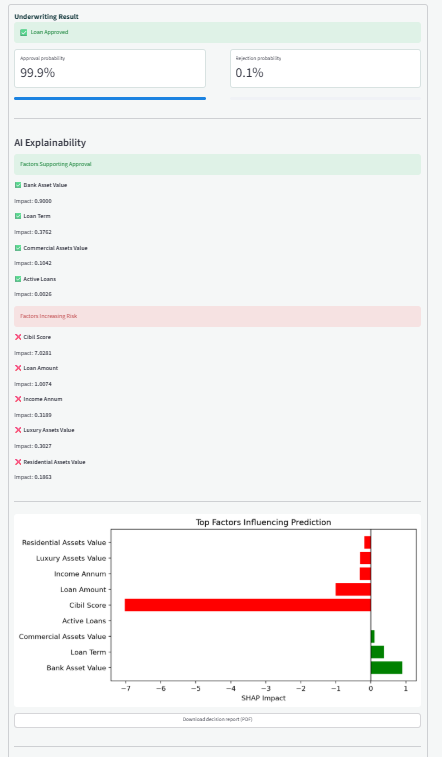
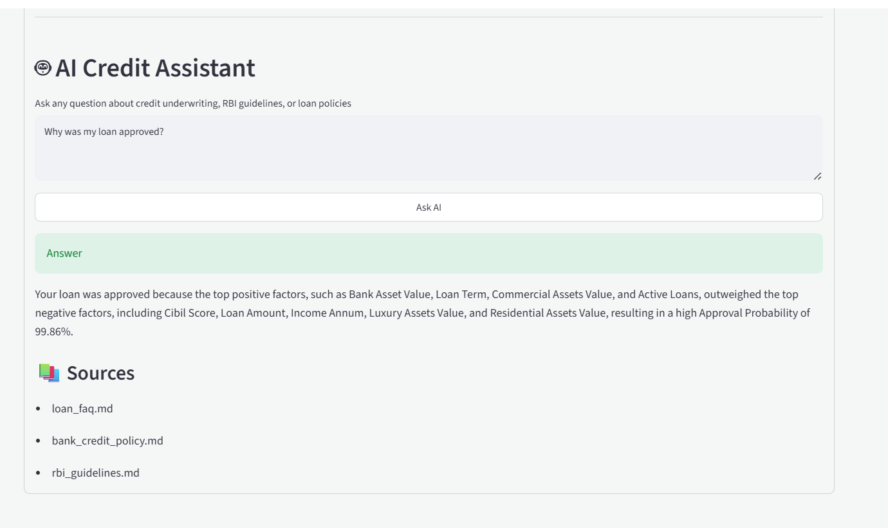

## 📑 Table of Contents

- Overview
- Features
- Technology Stack
- Architecture
- Application Preview
- Installation
- Docker
- Deployment
- REST APIs
- Machine Learning Pipeline
- Explainable AI
- RAG Assistant
- Future Enhancements
- Author

<p align="center">

</p>

# 🏦 AI Credit Underwriting Platform

> **Production-ready Machine Learning Platform for Intelligent Loan Approval Prediction with Explainable AI, REST APIs, Docker Deployment, and an AI-powered Retrieval-Augmented Generation (RAG) Assistant.**

<p align="center">


</p>

---

# 🌐 Live Demo

### 🚀 Streamlit Application

https://ai-predictive-methods-for-credit-underwriting-dfqmcy7nmn2bczde.streamlit.app

### ⚡ FastAPI Backend

https://ai-predictive-methods-for-credit.onrender.com

### 📘 API Documentation

https://ai-predictive-methods-for-credit.onrender.com/docs

---

# 📖 Overview

Financial institutions process thousands of loan applications every day. Traditional underwriting often relies on manual review, making the process slower, inconsistent, and difficult to scale.

The **AI Credit Underwriting Platform** leverages Machine Learning to automate credit approval decisions while maintaining transparency through Explainable AI (SHAP).

The platform combines:

- Intelligent loan approval prediction
- Explainable AI
- REST APIs using FastAPI
- Interactive Streamlit dashboard
- Dockerized deployment
- AI-powered RAG assistant *(deployment optimization in progress)*

This project demonstrates how modern Machine Learning can be deployed as a production-ready application instead of remaining only as a Jupyter Notebook model.

---

# ✨ Key Features

## 🤖 Machine Learning

- Loan approval prediction
- Gradient Boosting Classifier
- Data preprocessing pipeline
- Feature engineering
- Probability prediction
- Production inference

---

## 📊 Explainable AI

- SHAP Waterfall Plot
- SHAP Force Plot
- Feature Importance
- Individual Prediction Explanation
- Transparent Decision Making

---

## ⚡ FastAPI Backend

- REST APIs
- Pydantic validation
- Automatic OpenAPI documentation
- Error handling
- Health monitoring
- Production deployment

---

## 🎨 Interactive Dashboard

Built using Streamlit with

- Real-time prediction
- SHAP visualization
- PDF report generation
- Clean responsive UI
- API integration

---

## 📄 Automated Reports

Generate downloadable PDF reports containing

- Applicant information
- Prediction result
- Confidence score
- SHAP explanation
- Decision summary

---

## 🤖 AI Assistant (RAG)

The platform includes a Retrieval-Augmented Generation (RAG) assistant designed to answer underwriting-related questions using domain knowledge.

Current capabilities include:

- FAISS Vector Search
- Sentence Transformers Embeddings
- Groq LLM Integration
- Context-aware responses

> **Note:** The RAG pipeline is fully implemented and functional in the local development environment. Production deployment optimization for the hosted AI Assistant is currently in progress.

---

## 🐳 Docker Support

The application includes Docker configuration for simplified deployment and reproducible environments.

---

# 🛠️ Technology Stack

## Machine Learning

- Python
- Scikit-learn
- Pandas
- NumPy
- Joblib

---

## Explainable AI

- SHAP
- Matplotlib

---

## Backend

- FastAPI
- Uvicorn
- Pydantic

---

## Frontend

- Streamlit

---

## AI Stack

- FAISS
- Sentence Transformers
- Groq LLM

---

## DevOps

- Docker
- Docker Compose
- Render
- Streamlit Community Cloud

---

# 🏗️ System Architecture

```

                   +---------------------------+
                   |     Streamlit Frontend    |
                   +------------+--------------+
                                |
                                |
                                ▼
                    FastAPI REST API Server
                                |
      +-------------------------+-------------------------+
      |                         |                         |
      ▼                         ▼                         ▼
 ML Prediction          SHAP Explainability       PDF Generator
      |                         |                         |
      +-------------------------+-------------------------+
                                |
                                ▼
                     Gradient Boosting Model

                                |

                   (AI Assistant Pipeline)

User Question
      │
      ▼
Sentence Transformer
      │
      ▼
FAISS Vector Search
      │
      ▼
Relevant Context
      │
      ▼
Groq LLM
      │
      ▼
Generated Answer

```

---

# 📂 Project Structure

```text
AI-Predictive-Methods-for-Credit-underwriting/
│
├── api/                     # FastAPI backend
├── assets/                  # Images, icons, and static assets
├── data/                    # Dataset files
├── docker/                  # Docker-related configuration
├── docs/                    # Project documentation & screenshots
├── knowledge/               # Knowledge base for RAG
├── logs/                    # Application logs
├── models/                  # Trained ML models & artifacts
├── notebooks/               # Jupyter notebooks & experimentation
├── rag/                     # RAG pipeline implementation
├── tests/                   # Unit & integration tests
│
├── streamlit_app.py         # Streamlit frontend
├── model_training.py        # Model training script
├── docker-compose.yml
├── requirements-api.txt
├── requirements.txt
├── runtime.txt
├── LICENSE
├── README.md
└── .gitignore
```

---

# 📸 Application Preview

The following screenshots showcase the key functionalities of the AI Credit Underwriting Platform.

---

## 🏠 Dashboard

The main dashboard provides an intuitive interface for entering applicant details, generating predictions, and accessing explainable AI insights.

<p align="center">
  
</p>

---

## 📊 Loan Approval Prediction

Displays the predicted loan approval decision along with the model's confidence score.

<p align="center">
  
</p>

---

## 📘 API Documentation (Swagger UI)

Interactive OpenAPI documentation generated automatically by FastAPI for testing and exploring REST endpoints.

<p align="center">
  
</p>

---

## 📄 PDF Report Generation

Generate a downloadable report containing applicant information, prediction results, confidence score, and explainability summary.

<p align="center">
  
</p>

---

## 🤖 AI Assistant (RAG)

The platform also includes an AI-powered Retrieval-Augmented Generation (RAG) assistant for answering credit underwriting questions.

> **Current Status:** The AI Assistant is fully functional in the local development environment. Production deployment optimization is currently in progress.

<p align="center">
  
</p>


---

# 🚀 Getting Started

## Prerequisites

Before running the project, ensure you have the following installed:

- Python 3.11+
- Git
- Docker (Optional)
- Groq API Key
- pip

---

# ⚙️ Installation

## 1️⃣ Clone the Repository

```bash
git clone https://github.com/krish8986/AI-Predictive-Methods-for-Credit-underwriting.git

cd AI-Predictive-Methods-for-Credit-underwriting
```

---

## 2️⃣ Create a Virtual Environment

### Windows

```bash
python -m venv venv

venv\Scripts\activate
```

### Linux / macOS

```bash
python3 -m venv venv

source venv/bin/activate
```

---

## 3️⃣ Install Dependencies

### Backend

```bash
pip install -r requirements-api.txt
```

### Frontend

```bash
pip install -r requirements-streamlit.txt
```

---

## 4️⃣ Configure Environment Variables

Create a `.env` file in the project root.

```env
GROQ_API_KEY=your_groq_api_key
```

---

# ▶️ Running the Application

## Start FastAPI Backend

```bash
uvicorn api.main:app --reload
```

Backend:

```
http://127.0.0.1:8000
```

Swagger Documentation:

```
http://127.0.0.1:8000/docs
```

---

## Start Streamlit Frontend

```bash
streamlit run app/streamlit_app.py
```

Frontend:

```
http://localhost:8501
```

---

# 🐳 Docker Deployment

The project includes Docker support for consistent development and deployment.

## Build Docker Image

```bash
docker build -t ai-credit-underwriting .
```

---

## Run Container

```bash
docker run -p 8000:8001 ai-credit-underwriting
```

---

## Docker Compose

```bash
docker-compose up --build
```

---

# ☁️ Deployment

## Backend

**Platform**

- Render

Provides:

- FastAPI Hosting
- REST APIs
- Swagger Documentation
- Model Inference
- SHAP API
- Health Monitoring

---

## Frontend

**Platform**

- Streamlit Community Cloud

Provides:

- Interactive Dashboard
- Prediction Interface
- PDF Report Generation
- Explainability Visualizations

---

# 📡 REST API Endpoints

## Health Check

```
GET /health
```

Response

```json
{
  "status": "ok",
  "model_loaded": true
}
```

---

## Predict Loan Approval

```
POST /predict
```

Description

Predicts whether a loan application should be approved using the trained Gradient Boosting model.

Returns

- Prediction
- Probability
- SHAP explanation
- Confidence score

---

## AI Assistant

```
POST /ask
```

Description

Answers underwriting-related questions using Retrieval-Augmented Generation (RAG).

Current pipeline:

- Sentence Transformers
- FAISS Vector Search
- Groq LLM

> **Deployment Status:**  
> The AI Assistant is fully functional in the local development environment. Production deployment optimization is currently in progress.

---

# 🧠 Machine Learning Pipeline

The prediction workflow consists of the following stages:

```
Raw Applicant Data

        │

        ▼

Data Validation

        │

        ▼

Feature Engineering

        │

        ▼

Preprocessing Pipeline

        │

        ▼

Gradient Boosting Classifier

        │

        ▼

Probability Prediction

        │

        ▼

SHAP Explainability

        │

        ▼

Prediction Response
```

---

# 📈 Explainable AI

Instead of providing only a prediction, the platform explains every decision.

Supported visualizations include:

- SHAP Waterfall Plot
- SHAP Force Plot
- Feature Contribution Analysis
- Individual Prediction Explanation
- Global Feature Importance

This improves transparency and helps users understand why a particular prediction was generated.

---

# 🤖 Retrieval-Augmented Generation (RAG)

The AI Assistant uses a Retrieval-Augmented Generation architecture to provide context-aware responses.

Pipeline:

```
User Question

      │

      ▼

Sentence Transformer

      │

      ▼

Vector Embedding

      │

      ▼

FAISS Similarity Search

      │

      ▼

Relevant Context Retrieval

      │

      ▼

Groq LLM

      │

      ▼

Generated Response
```

Current Components:

- Sentence Transformers
- FAISS
- Groq API
- Prompt Engineering
- Context Retrieval

> **Note:**  
> The complete RAG pipeline is implemented and operational in the local development environment. Hosted deployment improvements are currently being worked on.

---

# 🔒 Model Performance

The deployed model provides:

- Fast inference
- Explainable predictions
- REST API integration
- Production-ready preprocessing
- Consistent prediction pipeline

---

# 📁 Environment Variables

| Variable | Description |
|-----------|-------------|
| `GROQ_API_KEY` | Groq API Key used for AI Assistant |

---

# 🚀 Future Enhancements

The platform will continue to evolve with additional production-ready features.

Planned improvements include:

- Production optimization of the AI Assistant deployment
- Authentication and Role-Based Access Control (RBAC)
- Batch loan application processing
- CI/CD pipeline using GitHub Actions
- Monitoring and logging dashboards
- Cloud-native deployment (AWS/GCP/Azure)
- Model retraining pipeline
- Loan decision analytics dashboard
- Multi-model comparison
- Real-time monitoring and alerting
- Kubernetes deployment

---

# 💼 Resume Highlights

This project demonstrates practical experience in:

- End-to-End Machine Learning Deployment
- Production-grade REST API Development
- Explainable AI (SHAP)
- Model Serialization & Inference
- Docker Containerization
- Streamlit Application Development
- FastAPI Backend Development
- Retrieval-Augmented Generation (RAG)
- Vector Search using FAISS
- LLM Integration using Groq API
- PDF Report Generation
- Production Deployment on Render & Streamlit Cloud

---

# 🎯 Key Learning Outcomes

Through this project, I gained hands-on experience in:

- Building production-ready Machine Learning applications
- Designing scalable API architectures
- Deploying ML models to cloud platforms
- Implementing Explainable AI for transparent predictions
- Building Retrieval-Augmented Generation (RAG) pipelines
- Integrating Large Language Models into ML workflows
- Dockerizing full-stack AI applications
- Managing environment variables and cloud deployments
- Structuring production-quality Python projects
- Debugging deployment-specific issues across local and cloud environments

---

# 📌 Project Status

| Module | Status |
|---------|--------|
| Machine Learning Pipeline | ✅ Complete |
| FastAPI Backend | ✅ Complete |
| Streamlit Frontend | ✅ Complete |
| Explainable AI (SHAP) | ✅ Complete |
| PDF Report Generation | ✅ Complete |
| Docker Support | ✅ Complete |
| REST API | ✅ Complete |
| Cloud Deployment | ✅ Complete |
| AI Assistant (RAG - Local) | ✅ Complete |
| AI Assistant (Hosted Deployment) | 🚧 Deployment Optimization in Progress |

Overall Project Completion: 95%+

---

# 📖 Interview Discussion Topics

This project can be discussed from multiple software engineering and machine learning perspectives.

### Machine Learning

- Gradient Boosting Classifier
- Feature Engineering
- Model Evaluation
- Prediction Confidence
- Production Inference

### Explainable AI

- SHAP Values
- Feature Importance
- Model Transparency
- Decision Interpretation

### Backend Engineering

- FastAPI
- REST APIs
- Pydantic Validation
- Error Handling
- API Design

### AI Engineering

- Retrieval-Augmented Generation (RAG)
- FAISS Vector Database
- Sentence Transformers
- Prompt Engineering
- Groq LLM Integration

### DevOps

- Docker
- Docker Compose
- Render Deployment
- Streamlit Cloud
- Environment Configuration

---

# 🤝 Contributing

Contributions, ideas, and suggestions are always welcome.

If you'd like to improve this project:

1. Fork the repository
2. Create a feature branch
3. Commit your changes
4. Open a Pull Request

---

# 📄 License

This project is licensed under the **MIT License**.

Feel free to use this project for educational purposes, research, and learning.

---

# 👨‍💻 Author

**Krishna Kumar**

Final Year B.Tech (Electronics & Communication Engineering) with minor in (AL/ML)

Maharaja Agrasen Institute of Technology (MAIT), New Delhi

Areas of Interest:

- Machine Learning
- Artificial Intelligence
- Backend Development
- Full Stack Development
- MLOps

### Connect with Me

- **LinkedIn:** https://www.linkedin.com/in/krishna-kumar-deve/
- **GitHub:** https://github.com/krish8986
- **Email:** krishnagaya234@gmail.com

---

# ⭐ Support

If you found this project helpful, consider giving it a ⭐ on GitHub.

It helps others discover the project and motivates future improvements.

---

<p align="center">

**Built with ❤️ using FastAPI, Streamlit, Scikit-learn, SHAP, FAISS, and Groq LLM**

</p>

# 🚀 Future Enhancements

The platform will continue to evolve with additional production-ready features.

Planned improvements include:

- Production optimization of the AI Assistant deployment
- Authentication and Role-Based Access Control (RBAC)
- Batch loan application processing
- CI/CD pipeline using GitHub Actions
- Monitoring and logging dashboards
- Cloud-native deployment (AWS/GCP/Azure)
- Model retraining pipeline
- Loan decision analytics dashboard
- Multi-model comparison
- Real-time monitoring and alerting

---

# 💼 Resume Highlights

This project demonstrates practical experience in:

- End-to-End Machine Learning Deployment
- Production-grade REST API Development
- Explainable AI (SHAP)
- Model Serialization & Inference
- Docker Containerization
- Streamlit Application Development
- FastAPI Backend Development
- Retrieval-Augmented Generation (RAG)
- Vector Search using FAISS
- LLM Integration using Groq API
- PDF Report Generation
- Production Deployment on Render & Streamlit Cloud

---

# 🎯 Key Learning Outcomes

Through this project, I gained hands-on experience in:

- Building production-ready Machine Learning applications
- Designing scalable API architectures
- Deploying ML models to cloud platforms
- Implementing Explainable AI for transparent predictions
- Building Retrieval-Augmented Generation (RAG) pipelines
- Integrating Large Language Models into ML workflows
- Dockerizing full-stack AI applications
- Managing environment variables and cloud deployments
- Structuring production-quality Python projects
- Debugging deployment-specific issues across local and cloud environments

---

# 📌 Project Status

| Module | Status |
|---------|--------|
| Machine Learning Pipeline | ✅ Complete |
| FastAPI Backend | ✅ Complete |
| Streamlit Frontend | ✅ Complete |
| Explainable AI (SHAP) | ✅ Complete |
| PDF Report Generation | ✅ Complete |
| Docker Support | ✅ Complete |
| REST API | ✅ Complete |
| Cloud Deployment | ✅ Complete |
| AI Assistant (RAG - Local) | ✅ Complete |
| AI Assistant (Hosted Deployment) | 🚧 Deployment Optimization in Progress |

---

# 📖 Interview Discussion Topics

This project can be discussed from multiple software engineering and machine learning perspectives.

### Machine Learning

- Gradient Boosting Classifier
- Feature Engineering
- Model Evaluation
- Prediction Confidence
- Production Inference

### Explainable AI

- SHAP Values
- Feature Importance
- Model Transparency
- Decision Interpretation

### Backend Engineering

- FastAPI
- REST APIs
- Pydantic Validation
- Error Handling
- API Design

### AI Engineering

- Retrieval-Augmented Generation (RAG)
- FAISS Vector Database
- Sentence Transformers
- Prompt Engineering
- Groq LLM Integration

### DevOps

- Docker
- Docker Compose
- Render Deployment
- Streamlit Cloud
- Environment Configuration

---

# 🤝 Contributing

Contributions, ideas, and suggestions are always welcome.

If you'd like to improve this project:

1. Fork the repository
2. Create a feature branch
3. Commit your changes
4. Open a Pull Request

---

# 📄 License

This project is licensed under the **MIT License**.

Feel free to use this project for educational purposes, research, and learning.

---

# 👨‍💻 Author

**Krishna Kumar**

Final Year B.Tech (Electronics & Communication Engineering)

Maharaja Agrasen Institute of Technology (MAIT), New Delhi

Interested in:

- Machine Learning
- Artificial Intelligence
- Backend Development
- Full Stack Development
- MLOps

### Connect with Me

- **LinkedIn:** https://www.linkedin.com/in/krishna-kumar-8986/
- **GitHub:** https://github.com/krish8986
- **Email:** *(Add your preferred email address here)*

---

# ⭐ Support

If you found this project helpful, consider giving it a ⭐ on GitHub.

It helps others discover the project and motivates future improvements.

---

<p align="center">

**Built with ❤️ using FastAPI, Streamlit, Scikit-learn, SHAP, FAISS, and Groq LLM**

</p>