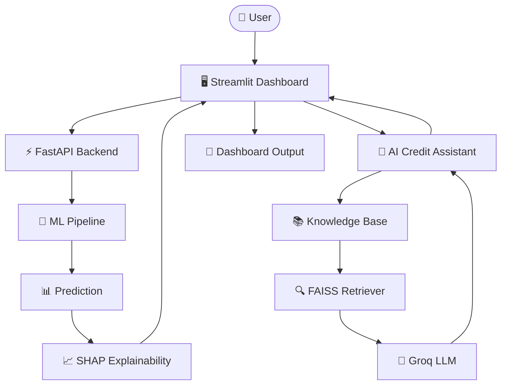

<p align="center">
  
</p>

<h1 align="center">🚀 AI Credit Underwriting Platform</h1>

<p align="center">

## 🌐 Live Demo

🚀 **Backend API:** https://ai-predictive-methods-for-credit.onrender.com

📘 **Swagger API Docs:** https://ai-predictive-methods-for-credit.onrender.com/docs

❤️ **Health Check:** https://ai-predictive-methods-for-credit.onrender.com/health

🚀 **Frontend API:** https://ai-predictive-methods-for-credit-underwriting-dfqmcy7nmn2bczde.streamlit.app

</p>

---

Production Machine Learning • Explainable AI (SHAP) • RAG • FastAPI • Streamlit • Groq LLM • FAISS
</p>

<p align="center">


</p>

### Production-Ready AI Credit Risk Assessment Platform

A production-style Machine Learning application that predicts whether a loan application should be **Approved** or **Rejected** using a trained **Gradient Boosting Model** deployed behind a **FastAPI REST API** and consumed by a modern **Streamlit Dashboard**.

Unlike traditional academic ML projects, this project follows a **production-inspired architecture** where the frontend, backend, and ML pipeline are cleanly separated.

---

## ✨ Key Highlights

- 🧠 Production Machine Learning Pipeline
- ⚡ FastAPI REST Backend
- 🎨 Modern Streamlit Dashboard
- 📊 Loan Approval Probability
- 📄 Explainable PDF Report
- 🧠 SHAP Explainability
- 🤖 AI Credit Assistant
- 📚 Retrieval-Augmented Generation (RAG)
- 🔍 FAISS Vector Search
- 🧠 Groq LLM Integration
- 📄 Source Citations
- 💬 Prediction-aware AI Responses
- 📊 Feature Importance Visualization
- ✅ Top Positive Decision Factors
- ⚠️ Top Negative Risk Factors
- ✅ Input Validation
- 🔍 Health Monitoring
- 🔄 End-to-End API Communication
- 🏗 Production-Oriented Architecture

---

# 🏛 System Architecture



---

# 🌟 Features

## 🎯 Intelligent Credit Assessment

Predicts whether a loan application should be approved using a trained Machine Learning model.

---

## ⚡ FastAPI Backend

The prediction engine is exposed as a REST API.

Endpoints:

- `/health`
- `/predict`

This architecture allows multiple clients to consume the prediction service.

---

## 🎨 Modern Dashboard

The Streamlit application provides a clean dashboard with:

- Applicant Information
- Employment Details
- Loan Details
- Financial Information
- Asset Information

---

## 📈 Prediction Analytics

The dashboard displays

- Approval Probability
- Rejection Probability
- Decision Status
- Progress Indicators

---

## 📄 PDF Report

Generate a downloadable underwriting report containing:

- Applicant Details
- Prediction
- Approval Probability
- Rejection Probability
- SHAP Explainability

---

## 🤖 AI Credit Assistant

The platform includes a Retrieval-Augmented Generation (RAG) powered AI assistant capable of answering credit underwriting questions.

Features:

- Loan approval reasoning
- RBI guideline queries
- Credit policy explanation
- Required loan documents
- Prediction-aware responses
- Source citations

Powered by:

- FAISS
- Sentence Transformers
- Groq LLM

Generate a downloadable underwriting report containing:

- Applicant details
- Prediction
- Probabilities
- Submitted application

---

## 🧩 Production ML Pipeline

The project uses a serialized sklearn Pipeline containing

- ColumnTransformer
- OneHotEncoder
- GradientBoostingClassifier

This guarantees that training and inference use identical preprocessing.

---

## 🛡 Input Validation

The dashboard validates

- Email
- Phone Number
- Required Fields

before sending requests to the API.

---

## ❤️ Service Health Monitoring

The dashboard continuously checks the FastAPI server using the `/health` endpoint before making prediction requests.

---

# 🛠 Tech Stack

| Category | Technologies |
|----------|--------------|
| Frontend | Streamlit |
| Backend | FastAPI, Uvicorn |
| Machine Learning | scikit-learn |
| Data Processing | pandas, NumPy |
| Model Persistence | joblib |
| Reporting | FPDF2 |
| Explainable AI | SHAP |
| RAG | FAISS, Sentence Transformers |
| LLM | Groq |
| Communication | REST API, Requests |
| Language | Python |

---

# 🚀 Deployment

| Service | Status |
|----------|--------|
| Backend | ✅ Render |
| REST API | ✅ FastAPI |
| API Documentation | ✅ Swagger UI |
| ML Model | ✅ Production Ready |
| Health Monitoring | ✅ Available |

### Live URLs

- 🌐 Backend API: https://ai-predictive-methods-for-credit.onrender.com
- 📘 Swagger Docs: https://ai-predictive-methods-for-credit.onrender.com/docs
- ❤️ Health Check: https://ai-predictive-methods-for-credit.onrender.com/health
- 🌐 Frontend API: https://ai-predictive-methods-for-credit-underwriting-dfqmcy7nmn2bczde.streamlit.app

---

# 📂 Project Structure

```text
AI-Predictive-Methods-for-Credit-underwriting/
│
├── api/
│   ├── __init__.py
│   ├── main.py                # FastAPI application
│   ├── model_loader.py        # Loads production ML pipeline
│   ├── predictor.py           # Prediction logic
│   └── schemas.py             # Request/Response models
│
├── rag/
│   ├── chunker.py
│   ├── embeddings.py
│   ├── retriever.py
│   ├── vector_store.py
│   ├── groq_generator.py
│
├── knowledge/
│   ├── bank_credit_policy.md
│   ├── loan_faq.md
│   ├── rbi_guidelines.md    
├── models/
│   └── credit_underwriting_pipeline.pkl
│
├── docs/
│   └── images/
│       ├── dashboard.png
│       ├── prediction_shap.png
│       ├── ai_assistant.png
│       ├── swagger.png
│       └── pdf_report.png
│
├── streamlit_app.py           # Streamlit dashboard
├── model_training.py          # Model training pipeline
├── credit_underwriting1.csv   # Training dataset
├── requirements.txt
├── FreeSerif.ttf              # PDF report font
├── README.md
│
└── legacy/
    └── best_features_model.pkl   # Legacy model artifact

```

> **Note:** `best_features_model.pkl` is retained only for historical reference. All predictions are served using `credit_underwriting_pipeline.pkl`.

---

# 🔄 Application Workflow

```text
User
   │
   ▼
Fill Loan Application
   │
   ▼
Streamlit Dashboard
   │
HTTP POST /predict
   │
   ▼
FastAPI Backend
   │
Load Production Pipeline
   │
Preprocess Input
   │
Generate Prediction
   │
Return JSON Response
   │
   ▼
Streamlit Dashboard
   │
Display Decision
   │
Generate PDF Report
   |
   ▼
Ask AI Assistant
   │
   ▼
Retrieve Relevant Documents
   │
   ▼
FAISS Search
   │
   ▼
Groq LLM
   │
   ▼
AI Response with Sources
```

---

# 🔌 REST API

## AI Assistant Endpoint

### Request

```http
POST /ask

## Health Endpoint

### Request

```http
GET /health
```

### Response

```json
{
    "status": "ok",
    "model_loaded": true
}
```

---

## Prediction Endpoint

### Request

```http
POST /predict
```

### Request Body

```json
{
  "applicant_age": 59,
  "gender": "Women",
  "marital_status": "Single",
  "employee_status": "employed",
  "residence_type": "MORTGAGE",
  "loan_purpose": "Vehicle",
  "income_annum": 9600000,
  "loan_amount": 2400000,
  "loan_term": 12,
  "cibil_score": 778,
  "residential_assets_value": 17600000,
  "commercial_assets_value": 22700000,
  "luxury_assets_value": 8000000,
  "bank_asset_value": 29900000,
  "loan_interest": 6.54,
  "loan_percent_income": 8,
  "active_loans": 3
}
```

### Response

```json
{
  "prediction": "Approved",
  "approval_probability": 0.9987,
  "rejection_probability": 0.0013,
  "top_positive": [
    {
      "feature": "CIBIL Score",
      "impact": 1.82,
      "direction": "positive"
    }
  ],
  "top_negative": [
    {
      "feature": "Active Loans",
      "impact": -0.46,
      "direction": "negative"
    }
  ]
}
```

---

# ⚙️ Installation

Clone the repository

```bash
git clone https://github.com/krish8986/AI-Predictive-Methods-for-Credit-underwriting.git

cd AI-Predictive-Methods-for-Credit-underwriting
```

Create a virtual environment

```bash
python -m venv .venv
```

Activate it

### Windows

```bash
.venv\Scripts\activate
```

### Linux / macOS

```bash
source .venv/bin/activate
```

Install dependencies

```bash
pip install -r requirements.txt
```

---

# ▶️ Running the Project

## Step 1 — Start FastAPI

```bash
python -m uvicorn api.main:app --reload
```

FastAPI will be available at

```
http://127.0.0.1:8000
```

Swagger Documentation

```
http://127.0.0.1:8000/docs
```

---

## Step 2 — Start Streamlit

Open another terminal

```bash
python -m streamlit run streamlit_app.py
```

Dashboard

```
http://localhost:8501
```

---

# 📊 Input Features

The production model predicts loan approval using **17 input features**.

### Applicant Information

- Applicant Age
- Gender
- Marital Status

### Employment Details

- Employment Status
- Residence Type
- Active Loans

### Loan Details

- Loan Purpose
- Loan Amount
- Loan Term
- Interest Rate
- Loan Percentage of Income

### Financial Information

- Annual Income
- CIBIL Score

### Asset Information

- Residential Assets
- Commercial Assets
- Luxury Assets
- Bank Assets

---

# 📄 Output

The application returns:

- ✅ Loan Decision
- ✅ Approval Probability
- ✅ Rejection Probability
- ✅ SHAP Explainability
- ✅ Top Positive Factors
- ✅ Top Negative Factors
- ✅ Feature Importance Chart
- ✅ Explainable PDF Report
- ✅ AI Credit Assistant
- ✅ Source Citations
- ✅ Prediction-aware AI Explanation
- ✅ Source Documents
- ✅ RAG Responses
- ✅ AI Reasoning

---

# 📸 Screenshots

## Dashboard

<p align="center">

</p>

---

## Prediction Result

<p align="center">

</p>

---

## Swagger API

<p align="center">

</p>

---

## PDF Report

<p align="center">

</p>

---

## AI Credit Assistant

<p align="center">

</p>

---


# 🚀 Future Roadmap

The project will continue evolving with production-grade Machine Learning and AI features.

## Phase 1 ✅ (Completed)

- Modern Streamlit Dashboard
- FastAPI REST Backend
- Production sklearn Pipeline
- Loan Approval Prediction
- PDF Report Generation
- Input Validation
- Health Check Endpoint
- API Integration

---
## Phase 2 ✅ (Completed)

- SHAP Explainability
- Feature Importance Visualization
- Top Positive Factors
- Top Negative Factors
- Prediction Reasoning
- AI Explainability Dashboard
- Explainable PDF Reports
---

## Phase 3 ✅ (Completed)

- AI Credit Assistant
- Credit Policy Knowledge Base
- FAISS Vector Search
- Groq LLM Integration
- Natural Language Decision Explanation
- Prediction-aware AI
- Source Citations

---

## Phase 4 🔜

- Docker Support
- CI/CD Pipeline
- Cloud Deployment
- Monitoring & Logging
- Authentication
- Rate Limiting

---

# 📈 Future Architecture

User
   │
   ▼
Streamlit Dashboard
   │
   ▼
FastAPI Backend
   │
   ▼
ML Pipeline
   │
   ▼
SHAP Explainability
   │
   ├────────► Dashboard
   │
   └────────► RAG Assistant
                 │
                 ▼
           Knowledge Base
                |
                ▼
             Chunking
                |
                ▼
            Embeddings
                |
                ▼
              FAISS
                |
                ▼
             Retriever
                |
                ▼
               Groq

---

# 💡 Engineering Highlights

This project demonstrates practical software engineering concepts beyond traditional Machine Learning projects.

### Backend Engineering

- REST API Development
- FastAPI
- Request Validation
- Response Serialization
- Modular Project Structure

---

### Machine Learning

- Gradient Boosting Classifier
- Production sklearn Pipeline
- ColumnTransformer
- OneHotEncoder
- Model Serialization
- Probability Prediction
- SHAP Explainability
- Explainable AI (XAI)
- Feature Attribution
- Retrieval-Augmented Generation (RAG)
- Vector Search (FAISS)
- Large Language Models (Groq)
- Prompt Engineering

---

### Frontend

- Streamlit Dashboard
- Custom CSS
- Interactive Forms
- API Integration
- PDF Report Generation

---

### Software Engineering

- Separation of Concerns
- Frontend–Backend Architecture
- Modular Design
- Error Handling
- Input Validation
- Clean Code Organization

---

# 🎯 Skills Demonstrated

- Python
- FastAPI
- Streamlit
- scikit-learn
- REST APIs
- Machine Learning
- Data Preprocessing
- API Integration
- Model Deployment
- Software Architecture
- Git
- GitHub
- Explainable AI (SHAP)
- RAG
- FAISS
- Vector Databases
- Sentence Transformers
- Groq API
- Prompt Engineering

---

# .env.example

- GROQ_API_KEY=your_groq_api_key

- MODEL_PATH=models/credit_underwriting_pipeline.pkl

- MODEL_PATH=models/credit_underwriting_pipeline.pkl

- FAISS_INDEX_PATH=rag/index.faiss

- EMBEDDING_MODEL=sentence-transformers/all-MiniLM-L6-

---

# .gitignore

.env
__pycache__/
.venv/
*.pyc
*.pkl

# 📚 Key Learnings

During this project I learned how to:

- Design a production-inspired ML architecture
- Separate frontend from backend services
- Build REST APIs with FastAPI
- Deploy ML models using sklearn Pipelines
- Maintain preprocessing consistency between training and inference
- Generate prediction reports programmatically
- Validate user inputs before inference
- Structure projects for scalability and maintainability

---

# 📊 Resume Highlights

This project demonstrates experience in:

- Production-ready Machine Learning
- API Development
- Backend Engineering
- ML Model Deployment
- Dashboard Development
- Software Design
- Data Processing
- Retrieval-Augmented Generation (RAG)
- Explainable AI
- Vector Search
- LLM Integration

---

# 🎤 Interview Discussion Topics

This repository can be used to discuss:

- Why FastAPI instead of Flask?
- Why use a sklearn Pipeline?
- Why separate frontend and backend?
- Why OneHotEncoder instead of LabelEncoder?
- How is preprocessing kept consistent?
- How does the REST API work?
- How would this scale for thousands of requests?
- How would Docker improve deployment?
- How would SHAP explain predictions?
- How would a RAG assistant improve the system?
- Why SHAP instead of LIME?
- How does TreeExplainer work?
- How are feature contributions calculated?
- How do you explain ML predictions to non-technical users?
- Why did you choose FAISS?
- Why Groq instead of OpenAI?
- How does Retrieval-Augmented Generation work?
- Why use SHAP with Gradient Boosting?
- How is prediction context passed to the AI Assistant?
- How do source citations improve trust?
---

# 🤝 Contributions

Contributions, suggestions, and improvements are welcome.

If you find an issue or have an idea for improvement:

1. Fork the repository
2. Create a feature branch
3. Commit your changes
4. Open a Pull Request

---

# ⭐ Support

If you found this project useful, consider giving it a ⭐ on GitHub.

It helps increase visibility and motivates future improvements.

---

# 📄 License

This project is licensed under the MIT License.

---

# 👨‍💻 Author

## Krishna Kumar

B.Tech Electronics & Communication Engineering (Minor in AI/ML)

Backend Developer • Machine Learning Engineer • AI Enthusiast

### Connect with me

- GitHub: https://github.com/krish8986
- LinkedIn: https://www.linkedin.com/in/krishna-kumar-deve/

If you found this project useful, please consider giving it a ⭐.

## ⭐ Support

If you found this project useful:

- ⭐ Star this repository
- 🍴 Fork it
- 🛠️ Contribute improvements
- 💬 Share feedback

Your support helps improve the project and motivates future development.
